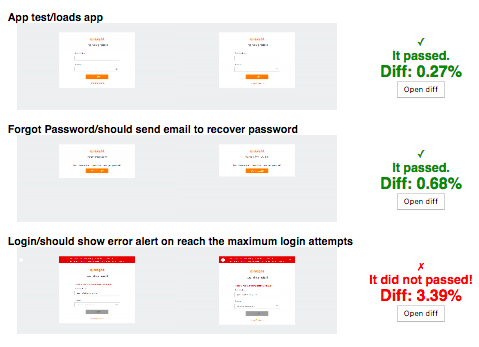

[](http://badge.fury.io/js/testcafe-blink-diff)
[](https://snyk.io/test/npm/testcafe-blink-diff)

# How it works?

Install this dependency in your project, e.g. `npm i testcafe-blink-diff --save-dev`

Call the `takeSnapshot()` helper within your tests, e.g.

```js
import { takeSnapshot } from 'testcafe-blink-diff';

fixture('Snapshots')
  .page('http://localhost:8080');

test('check something here', async t => {
  // verify anything you want before
  await t
    .click('...')
    .expect('...')
    .ok();

  // then pass the `t` reference to invoke the helper
  await takeSnapshot(t);
});
```

Each time you run tests with `--take-snapshot base` it'll take the **base** screenshots.

```bash
$ npx testcafe chrome:headless tests/e2e/cases -s tests/screenshots --take-snapshot
```

Now run the same tests `--take-snapshot actual` to take the **actual** screenshots to compare with.

Finally, invoke the CLI for generating a simple `generated/index.html` report, e.g.

```bash
$ npx testcafe-blink-diff tests/screenshots --compare base:actual --open --threshold 0.03 # <= 3% is OK
```

That's all, explore the generated report and enjoy!

<p align="center">
  
</p>

## API Options

`takeSnapshot(t[, label[, options]])`

> If the given selector does not exists on the DOM, a warning will be raised.

- `label|options.label` &mdash; Readable name for the taken snapshot
- `options.as` &mdash;  Valid identifier for later comparison
- `options.base` &mdash; Custom folder for saving the taken snapshot
- `options.timeout` &mdash; Waiting time before taking snapshots
- `options.selector` &mdash; String, or `Selector()` to match on the DOM
- `options.blockOut` &mdash; List of `Selector()` nodes to "block-out" on the snapshot
- `options.fullPage` &mdash; Enable `fullPage: true` as options passed to `takeScreenshot(...)`

If you set `selector` as an array, then the list of _possible nodes_ will be used to the snapshot.

If no selectors are given, then it'll take page-screenshot of the visible content, unless `fullPage` is enabled.

> "Block-out" means matched DOM nodes are covered by a solid-color overlay, helping to reduce unwanted differences if they change often, e.g. ads

Type `npx testcafe-blink-diff --help` to list all available options.
